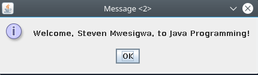

# java-how-to-program
My journey through the "JAVA How to Program, 10th Edition" BOOK by Deitel. Working out some exercises in the book as i go. "Practice Makes Perfect" :)

## Getting Started

[//]: # "These instructions will get you a copy of the project up and running on your local machine for development and testing purposes. See deployment for notes on how to deploy the project on a live system."

Before we begin, open a terminal and run the following commands to ensure that you have valid versions of Java .
```bash
java -version
``` 
>**Output:**
```
java version "10.0.2" 2018-07-17
Java(TM) SE Runtime Environment 18.3 (build 10.0.2+13)
Java HotSpot(TM) 64-Bit Server VM 18.3 (build 10.0.2+13, mixed mode)

```


## Prerequisites

What things you need to install *(the software)* and how to install them

* You need atleast **JDK_v9**, though **JDK_v10** or later is recommended. 

>* **TIP:** Newer versions of *Netbeans*, *Eclipse* or *IntelliJ* allow you to switch between different *"Java Platforms"* on the fly without changing your ***default*** Java Platform.

>* i.e For Netbeans users, Apache-Netbeans 9 or later: ``Tools > Java Platforms > Add Platform...``. After adding your desired *Java platform*, Right-click on your Project ``> Properties > Sources > Source/Binary Format: >`` then choose your desired *Java Platform* from the drop down list and SAVE. 

## Installing (Deployment)
A step by step series of examples that tell you how to get a development env running

 **OPTION 1:**

1. First, open up your *terminal* and clone the repository to your Computer.

```bash
git clone https://github.com/steven7mwesigwa/java-how-to-program.git
```

2. Start your favorite IDE *(integrated development environment)* i.e *Netbeans, Eclipse or IntelliJ* and open the project.

	* An IDE should easily handle compiling and navigating through the containing sub projects.

	>* **NOTE:** You might need to adjust the *Java Platform* in your IDE to use [JDK_v10](http://www.oracle.com/technetwork/java/javase/downloads/jdk10-downloads-4416644.html) or later to smoothly run this current project.

	* The root of the project is in the ``src`` folder.
	```bash
	cd java-how-to-program/io/bitbucket/steven7mwesigwa/JavaHowToProgram/src/
	```
3. Check out this link of **[Sub Projects.](#project-list)**
    * ``Run`` the corresponding ***Solution*** files as required for each ***Question***.

 **OPTION 2:**

For those of you who prefer to run these sub projects from the terminal, All hope is not lost.
Follow the steps below to get you up and running:

>* **NOTE:** These steps below are ***ONLY*** for those who don't want to change their default JDK version BUT still want to try out or play with these sub projects from the terminal. 

>* I will be using *Linux (debian)* as my Operating system BUT you should be able to follow along just fine.


1. Download the zipped file containing [Oracle JDK v10](http://www.oracle.com/technetwork/java/javase/downloads/jdk10-downloads-4416644.html) to your preferred location.
	* Then, Unzip / Extract it. i.e
	> * **NOTE:** Take note of this destination folder. As for me, i will extract it in my *"home directory"*. i.e i will end up with a ``~/jdk-10.0.2_linux-x64_bin`` folder AFTER unzipping. This is where our **JDK_v10** is located. We will need it when building with **``Ant build tool``**

	```bash
	tar -xf jdk-10.0.2_linux-x64_bin.tar.gz
	```` 

2. Before we play with the project, we need a "Build tool" to make building easy.
	* For this project , we will use "**Ant** build tool". Follow this [Ant Installation](https://ant.apache.org/manual/install.html) link.


3. Clone the repository and  change *"current working directory"* to the root of the project. .ie

```bash
git clone https://github.com/steven7mwesigwa/java-how-to-program.git

cd java-how-to-program/io/bitbucket/steven7mwesigwa/JavaHowToProgram
```

4.	Since this project already has a ``build.xml`` file. Lets build all our JAVA files with **``Ant``**. i.e
   > * Note how we're specifying which ***Java Platform*** we want to build with.

```bash
ant -Dplatforms.JDK_10.home="~/jdk-10.0.2_linux-x64_bin/jdk-10.0.2" jar
```
>* **NOTE:** If you don't specify a location of your *Java Platform* while running the above ``ant`` command, you will end up with the error below:
```
The J2SE Platform is not correctly set up.
 Your active platform is: JDK_10, but the corresponding property "platforms.JDK_10.home" is not found in the project's properties files. 
 Either open the project in the IDE and setup the Platform with the same name or add it manually.
 For example like this:
     ant -Duser.properties.file=<path_to_property_file> jar (where you put the property "platforms.JDK_10.home" in a .properties file)
  or ant -Dplatforms.JDK_10.home=<path_to_JDK_home> jar (where no properties file is used)
```

* Once our BUILD is SUCCESSFUL, Lets define a ``classpath`` for our built ***.class*** files.

    * Open ``build.xml`` file from the root of project and add the snippet below BEFORE the `` </project>`` line.


	```bash
	    <classpath>
             <pathelement location="build/*"/>
        </classpath>
	```

> **NOTE:** If you don't specify a ``classpath`` for your built JAVA files, you will end up with a ``java.lang.NoClassDefFoundError:`` error.


5. CONGRATULATIONS!!. If you have made it this far, we are now ready to play with our sub projects.

*
	* **PROJECT1:**

```bash
jdk-10.0.2_linux-x64_bin/jdk-10.0.2/bin/java -cp build/classes chapter2.drawshapes.Main 
```

*
    * **PROJECT2:**

```bash
jdk-10.0.2_linux-x64_bin/jdk-10.0.2/bin/java -cp build/classes chapter3.bankaccount.AccountTest
```

*
    * **PROJECT3:**

```bash
jdk-10.0.2_linux-x64_bin/jdk-10.0.2/bin/java -cp build/classes chapter3.create.graphical.user.interfaces.messagedialog.MessageDialog
```


*
    * **PROJECT4:**

```bash
jdk-10.0.2_linux-x64_bin/jdk-10.0.2/bin/java -cp build/classes chapter3.create.graphical.user.interfaces.inputdialog.InputDialog
```


*
    * For more **PROJECTS** check the **[project list.](#project-list)**

[//]: # "2. Then change *'current working directory'* to the root of this project."

[//]: # "## Running the testsExplain how to run the automated tests for this system"

[//]: # "### Break down into end to end testsExplain what these tests test and whyGive an example"


[//]: # "### And coding style testsExplain what these tests test and whyGive an example"


[//]: # "## DeploymentClone the repository to your Computer."


[//]: # "Add additional notes about how to deploy this on a live system"

## Built With

* [Oracle Java SE 10.0.2](http://www.oracle.com/technetwork/java/javase/downloads/jdk10-downloads-4416644.html) - A Java SE Development Kit for developing and running JAVA applications.


[//]: # "* [Dropwizard](http://www.dropwizard.io/1.0.2/docs/) - The web framework used* [Maven](https://maven.apache.org/) - Dependency Management* [ROME](https://rometools.github.io/rome/) - Used to generate RSS Feeds"

## Contributing

Feel free to contribute to anything.
Please don't hesitate to submit issues and pull-requests against this project.

1. **[Fork](https://github.com/steven7mwesigwa/java-how-to-program/fork)** the repository.
    * This allows you to freely experiment with changes without affecting the original project. 
2. Create your *feature* branch.
    * i.e  (`git checkout -b feature/fooBar`)
3. Commit your changes.
    * i.e  (`git commit -am 'Add some fooBar'`)
4. Push to the branch.
    * i.e  (`git push origin feature/fooBar`)
5. Create a new Pull Request. 

Please read [CONTRIBUTING.md](https://github.com/steven7mwesigwa/java-how-to-program/blob/master/CONTRIBUTING.md) for details on our code of conduct, and the process for submitting pull requests to us.

## Versioning

We use [SemVer](http://semver.org/) for versioning. For the versions available, see the [tags on this repository](https://github.com/steven7mwesigwa/java-how-to-program/tags). 

## Authors

* **Steven Mwesigwa** - *Initial work* - **[Github](https://github.com/steven7mwesigwa)** - **[Twitter](https://twitter.com/steven7mwesigwa)**


[//]: # "See also the list of [contributors](https://github.com/your/project/contributors) who participated in this project."

## License

This project is licensed under the MIT License - see the [LICENSE](https://github.com/steven7mwesigwa/java-how-to-program/blob/master/LICENSE) file for details

## Release History
* [v0.1.0-alpha.1](https://github.com/steven7mwesigwa/java-how-to-program/releases)
    * This is the first Release for the Project. Currently on Chapter 3 - -…
… Page 134 ------Title 3.6 (Optional) GUI and Graphics Case Study: Using Dialog Boxes

## Acknowledgments

* I would like to extend my sincere thanks to the founders of [Deitel & Associates, Inc.](http://www.deitel.com/Books/Java/JavaHowtoProgram10eEarlyObjects/tabid/3656/Default.aspx) that is [Paul J. Deitel](https://www.linkedin.com/in/pauldeitel) *(Author)* and Harvey M. Deitel *(Author)* for such a detailed JAVA programming book.

[//]: # "* Hat tip to anyone whose code was used* Inspiration* etc"


## <a name="project-list"></a>List of Sub Projects

* **Qn-1:** *(page109)*  2.18 (*Displaying Shapes with Asterisks*) Write an application that displays a box, an oval, an arrow and a diamond using asterisks ( * ), as follows:


**Soln-1:** 
```
chapter2.drawshapes.Main
```
* **Qn-2:** *(page114)* ``CASE STUDY.``  We present a case study on creating and using a simple, real-world bank account
class— Account . Such a class should maintain as instance variables attributes such as its name
and balance , and provide methods for tasks such as querying the balance ( getBalance ),
making deposits that increase the balance ( deposit ) and making withdrawals that decrease
the balance ( withdraw ). We’ll build the getBalance and deposit methods into the class in
the chapter’s examples and you’ll add the withdraw method in the exercises.


**Soln-2:** 
```
chapter3.bankaccount.AccountTest
```

* **Qn-3:** *(page134)* ``GUI and Graphics Case Study.`` *Displaying Text in a Dialog Box*. The programs presented thus far display output in the command window. Many apps use
windows or dialog boxes (also called dialogs) to display output. Web browsers such as
Chrome, Firefox, Internet Explorer, Safari and Opera display web pages in their own win-
dows. E-mail programs allow you to type and read messages in a window. Typically, dialog
boxes are windows in which programs display important messages to users. Class JOption-
Pane provides prebuilt dialog boxes that enable programs to display windows containing
messages—such windows are called message dialogs. Figure 3.12 displays the String
"Welcome to Java" in a **message dialog**. 

**Soln-3:** 

```
chapter3.create.graphical.user.interfaces.messagedialog.MessageDialog
```


* **Qn-4:** *(page135)* ``GUI and Graphics Case Study.`` *Entering Text in a Dialog.* Figure 3.13 uses another predefined ``JOptionPane`` dialog called an **input dialog** that allows
the user to enter data into a program. The program asks for the user’s name and responds
with a message dialog containing a greeting and the name that the user entered.


**Soln-4:** 

```
chapter3.create.graphical.user.interfaces.inputdialog.InputDialog
```




* **Qn-5:** *COMING SOON!!*

